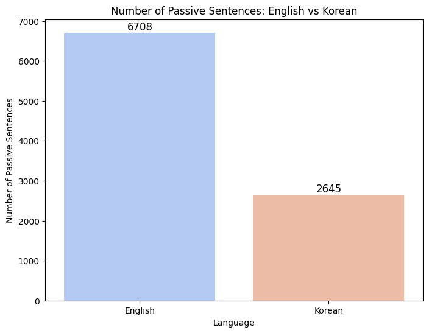

2024-2 언어데이터과학 기말프로젝트 최종보고서

# AI Hub 한영 번역 말뭉치를 활용한 한국어 피동문과 영어 수동문의 생산성 분석

2021-14058 이예은

## 1 서론

### 1.1 연구 배경 및 목적

전통적인 관점에서 한국어는 영어에 비해 수동/피동 표현이 적게 나타나는 언어로 여겨진다. 이는 다음과 같은 이유로 설명된다(서영환, 2013). (1) 수동문은 영어처럼 주어(subject)가 두드러지는 언어에서 자주 나타나는 반면, 한국어처럼 주제(topic)가 중심인 언어에서는 드물거나 주변적인 위치를 차지한다. (2) 한국어에서는 능동문에서도 행동주(agent)를 생략할 수 있지만, 영어에서 행동주를 생략하기 위해서는 수동태 문장 구조를 사용해야 한다. 

이러한 이유로 한국어에서 수동/피동 표현은 영어에 비해 생산성이 낮다고 평가되며, 영어 수동 표현은 한국어에서 피동형이 아닌 능동형으로 번역될 것이 권장되고 실제 번역에서도 그러한 경향을 보인다. 관련 연구는 주로 영한 번역을 중심으로 이루어졌지만, 본 프로젝트는 한영 번역 말뭉치를 활용하여 두 언어 간 수동/피동 표현의 생산성 차이를 비교‧검증하고자 한다. 

구체적으로, 한영 번역 데이터에서 영어 수동문이 한국어 능동문이나 피동문에서 생성된 비율을 분석한다. 만약 한국어 원문이 능동문임에도 영어 번역문에서 수동 표현이 빈번히 선택된다면, 이는 영어에서 수동 표현이 문맥적으로 더 생산적인 선택일 가능성을 시사한다. 본 연구는 이러한 분석을 통해 두 언어 간 수동/피동 표현의 상대적 생산성을 정량적으로 평가하고, 번역 과정에서 드러나는 언어적 특성을 규명하고자 한다.

### 1.2 연구 계획 대비 목표 달성 결과

||계획|실행|결과|
|--|--|--|--|
|데이터 수집|[[AI Hub]]에서 [한국어-영어 번역(병렬) 말뭉치] 중 [대화체 데이터(10만 문장)] 다운로드|한국어-영어 번역(병렬) 말뭉치 중 대화체 xlsx 파일 다운로드|전체 달성|
|데이터 전처리|xlsx 파일 --> 데이터프레임 변환|pandas를 사용하여 실행|전체 달성|
|데이터 가공1|pandas, 정규표현식, spaCy, koNLPy, jamo 등의 라이브러리를 사용하여 영어 및 한국어 데이터에서 수동/피동 표현 감지|[영어 수동문 감지 패턴 출처](https://stackoverflow.com/questions/74528441/detect-passive-or-active-sentence-from-text)|전체 달성|
|데이터 가공2|영어 수동문을 기준으로 전체 데이터를 필터링하고, 한국어 피동 표현을 기준으로 전체 데이터를 추가 필터링하는 교차 분석을 통해 연구 결과의 신뢰성 향상|영어 수동문을 기준으로만 전체 데이터를 필터링|일부 달성|
|데이터 활용|가공된 병렬 데이터를 기반으로 영어 수동문과 한국어 피동문의 대응 양상 비교 및 시각화|Matplotlib, Seaborn 라이브러리를 사용해서 실행|전체 달성|

### 1.2.1 미달성 사유

+ **데이터 가공 2**: 전체 데이터를 한국어 피동 표현 기준으로 필터링했을 때, 사동 접사와 피동 접사를 구분하지 못하는 문제가 발생하여 오류 데이터가 다수 포함되었다. 이에 따라 원래 계획을 수정하여 영어 수동문을 기준으로만 데이터를 필터링했다.

## 2 연구 방법

### 2.1 코퍼스

[[AI Hub]] [한국어-영어 번역(병렬) 말뭉치]는 AI 번역 엔진 개발을 위해 구성된 데이터로, 문어체 한영 번역 110만 문장과 구어체 한영 번역 50만 문장으로 이루어져 있다. 데이터는 '뉴스, 정부 웹사이트/저널, 법률, 한국문화, 구어체, 대화체' 등 총 6개 주제로 구분되며, 각각 xlsx 파일 형식으로 제공된다. 이 중 대화체 데이터(약 10만 문장, 9MB)를 다운로드하여 분석에 활용하였다. 

### 2.2 데이터 전처리
pandas를 사용해서 xlsx 파일을 데이터프레임으로 변환하고, 결측치를 제거한 다음 '대분류, 소분류, 상황, Set Nr, 발화자, 원문, 번역문' 열 중 필요한 정보인 '원문', '번역문'만 남겼다. 원문과 번역문 텍스트는 데이터 구축 단계에서 이미 가이드라인에 따라 특수 기호 등이 정제되었으므로 추가적인 텍스트 전처리는 필요하지 않았다. 

데이터 전처리 과정의 구현 방법은 아래 코드의 "2.2 데이터 전처리" 부분에서 확인할 수 있다.
+ [[final_project](../codes/final_project.ipynb)]

### 2.3 데이터 가공

전체 데이터에서 영어 수동문을 감지한 뒤, 수동문이 포함된 데이터만 필터링하여 해당 범위 내에서 대응하는 한국어 원문의 피동 표현을 분석했다.

영어 수동문 감지는 [Stack Overflow 솔루션](https://stackoverflow.com/questions/74528441/detect-passive-or-active-sentence-from-text)을 참고하여 spaCy 라이브러리의 Matcher 클래스를 활용해 구현했다. 10만 개의 데이터 중 수동문이 1개 이상 포함된 데이터를 필터링한 결과, 전체 데이터의 약 6.47%인 6,467개의 데이터가 추출되었다. 

이후 필터링된 6,467개의 병렬 데이터를 대상으로 한국어 원문의 피동 표현을 감지하고 개수를 계산했다. 피동 표현 감지에는 koNLPy의 Kkma 클래스와 jamo 라이브러리를 활용했으며, 다음과 같은 세 가지 유형으로 피동 표현을 분류했다.

**1. 피동 접미사 "-이/히/리/기-"를 포함한 패턴**
- 이 때 동사 어근 자체에 "이/히/리/기"가 포함되어 오류가 발생하는 것을 방지하기 위해 "드리다", "모이다"와 같은 예외를 설정했다.

**2. 보조동사 "-어지다"를 포함한 패턴**
- 이 때 자모 분석을 통해 'ㅡ' 탈락과 어간 말 모음 'ㅏ, ㅓ, ㅐ, ㅔ' 뒤에서 연결 어미 "어/아"가 탈락하는 환경에서도 피동 표현을 감지하도록 설정했다. (예: 보내+(어)+지+다 --> 보내지다, 끄+(어)+지+다 --> 꺼지다)

**3. 피동 접미사 "-되다", "-받다", "-당하다"를 포함한 패턴**
- 이 때 해당 표현이 접미사가 아닌 동사로 쓰이는 경우는 띄어쓰기 여부를 기준으로 필터링하여 제외했다.  

최종 데이터프레임은 원문, 번역문, kor_passive_count, eng_passive, count 네 개의 변수를 가진 6467행으로 구성되었다. 아래는 데이터프레임의 예시이다. 

|| 원문 | 번역문 | kor_passive_count | eng_passive_count |
|--|--|--|--|--|
|0|우리 제품은 어떤 방식으로 도쿄에 보내지나요? |How will our products be shipped to Tokyo?| 1 | 1 |
|1|먼저 배로 도쿄 근처 항구까지 운반하고 그 후 차를 이용합니다.|They'll be sent to Tokyo port by the ship, then transported by vehicles.| 0 | 1 |
|2|교육 안내 메일 하단에 작은 글씨로 적혀있어요.|It was written in very small letters at the bottom of the notification email.| 1 | 1 |
|3|7월 29일부터 8월 2일까지가 공식적인 기간이에요.|It's officially scheduled from July 29 to August 2.| 0 | 1 |
|4|네, 메일로 이미 공지를 했으니 다들 알고 있을 거에요.|Sure, but they'd already known since it was notified by email earlier.| 0 | 1 |
|...|...|...|...|...|

데이터 가공 과정의 구현 방법은 아래 코드의 "2.3 데이터 가공" 부분에서 확인할 수 있다.
+ [[final_project](../codes/final_project.ipynb)]

## 3 연구 결과

### 3.1 현상 기술
영어 수동문을 기준으로 필터링한 6,467개의 데이터에서 감지된 영어 수동문과 한국어 피동 표현의 개수는 다음과 같다.

- 영어 수동 표현 개수(eng_passive_count의 합계): 6,708개 
- 한국어 피동 표현 개수(kor_passive_count의 합계): 2,645개 

한 데이터에서 수동/피동 표현이 여러 개 나타날 수 있으므로 수동/피동 표현의 개수가 데이터 개수를 초과할 수 있다.

다음으로, 영어 수동문과 한국어 원문의 번역 관계를 피동 표현 개수를 기준으로 시각화하여 분석했다.

|Category|Description|Percentage(%)|
|--|--|--|
|Independently Generated|영어 수동 표현 개수 > 한국어 피동 표현 개수|66.4%|
|Translated from Korean Passive|영어 수동 표현 개수 == 한국어 피동 표현 개수|28.2%|
|Reduced in Translation|영어 수동 표현 개수 < 한국어 피동 표현 개수|5.3%|

데이터 시각화 과정의 구현 방법은 아래 코드의 "3 연구 결과" 부분에서 확인할 수 있다.
+ [[final_project](../codes/final_project.ipynb)]

### 3.2 분석 

**1. 영어 수동 표현 개수 > 한국어 피동 표현 개수**

영어 번역에서 수동 표현이 독자적으로 생성된 사례로 볼 수 있다. 예를 들어 한국어 원문이 능동 표현이거나 피동 표현이 더 적었는데, 영어 번역에서 문맥상 수동 표현이 필요했을 가능성이 높다.

**2. 영어 수동 표현 개수 == 한국어 피동 표현 개수**

이 경우, 한국어 피동 표현이 구조적 변환 없이 영어 수동 표현으로 그대로 번역된 경우로 해석된다.

**3. 영어 수동 표현 개수 < 한국어 피동 표현 개수**

일부 한국어 피동 표현이 영어에서 능동 표현으로 번역된 사례로 볼 수 있다. 이는 특정 표현이 한국어에서는 피동으로 사용되지만 영어에서는 능동 표현으로 주로 사용되기 때문일 가능성이 있다.

분석 결과, 영어 수동 표현이 한국어 피동 표현보다 많은 경우가 전체의 66.4%로 가장 많았다. 영어 수동 표현 개수가 한국어 원문의 피동 표현 개수와 같아 그대로 번역된 경우는 28.2%, 영어 수동 표현이 한국어보다 적은 경우, 즉 한국어 피동 표현이 영어에서 능동으로 번역된 경우는 5.3%로 나타났다. 이는 한국어-영어 번역 과정에서 영어 수동 표현이 독자적으로 생성되는 경우가 많고, 영어 수동 표현의 생산성이 높다는 것을 암시한한다. 

## 4 결론

본 연구에서는 AI Hub 한영 번역 말뭉치를 활용하여 영어 수동문과 한국어 피동문의 생산성을 분석했다. 전체 데이터에서 영어 수동문을 포함한 데이터를 필터링한 뒤, 대응하는 한국어 원문에서 피동 표현을 감지하였다. 영어 번역문에서 나타난 수동 표현의 기원을 분석한 결과, 한국어 원문에는 피동 표현이 없었으나 영어 번역에서 수동 표현이 독자적으로 생성된 경우가 67.1%로 가장 많았다. 이어서, 한국어 피동 표현이 영어 수동문으로 그대로 유지된 경우가 28.2%, 능동문으로 변환된 경우가 5.3%로 나타났다. 이는 영어 수동 표현의 빈도가 한국어 원문에 비해 높고, 생산성이 높다는 기존 이론을 지지하는 결과로 볼 수 있다.

다만 본 연구는 영어 수동문 감지에서 출발하여 이를 한국어 원문의 피동 표현과 비교·분석했으며, 한국어 원문의 피동 표현 감지에서 출발하는 교차 검증은 진행하지 못했다. 이에 따라 한국어와 영어의 수동/피동 표현의 생산성에 대한 분석 결과를 일반화하는 데 한계가 있다. 향후 한국어 피동 표현을 보다 정교하게 감지할 수 있는 방법을 개발하고 이를 기준으로 추가 분석을 수행한다면 더 신뢰성 있는 교차 검증과 결론을 도출할 수 있을 것이다.

## 참고 문헌

+ AI 허브(2019). 한국어-영어 번역(병렬) 말뭉치. URL: https://aihub.or.kr/aihubdata/data/view.do?currMenu=115&topMenu=100&aihubDataSe=realm&dataSetSn=126
+ 서영환(2013). 〈영한 번역문에 나타난 능동-수동문 대응>. 《현대영미어문학》 31(1), 41-61. URL: https://kiss.kstudy.com/thesis/thesis-view.asp?key=387814
+ 원은하, 진실로(2021). <영어 수동문의 한국어 기계번역 분석>. 《언어과학연구》 98, 327–351. URL: https://doi.org/10.21296/jls.2021.9.98.327
+ 유연(2017). <한국어 상태변화 구문 : ’-어지다’와 “-게 되다” 연구>. 서울대학교 대학원. URL: https://s-space.snu.ac.kr/bitstream/10371/137110/1/000000145952.pdf 
