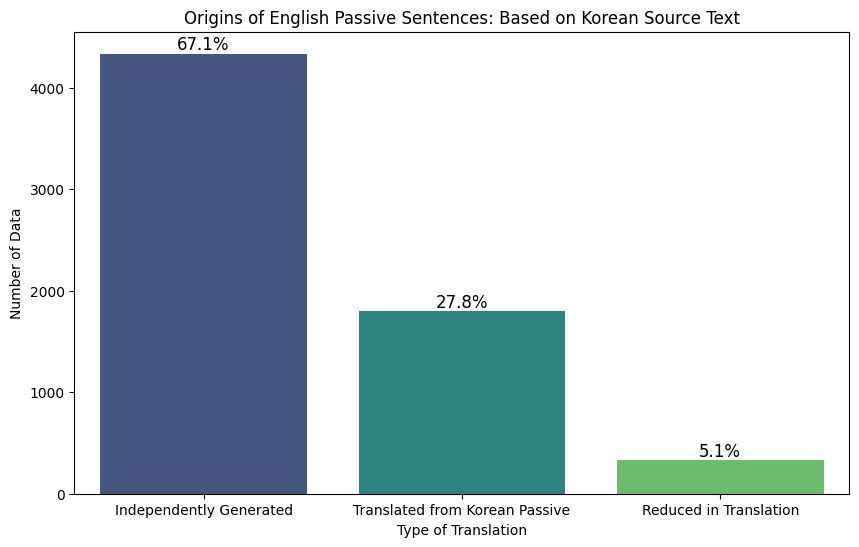

2024-2 언어데이터과학 기말프로젝트 최종보고서

# AI Hub 한국어-영어 번역 말뭉치를 통한 한국어 피동문과 영어 수동문의 대응 양상 분석

2021-14058 이예은

## 1 서론

### 1.1 연구 배경 및 목적

 전통적인 관점에서 한국어는 영어에 비해 수동/피동 표현이 적게 나타나는 언어로 여겨진다. 이에 대한 대표적인 근거는 다음과 같다(서영환, 2013). (1) 수동문은 영어처럼 주어(subject)가 두드러지는 언어에서 흔히 나타나는 반면, 한국어처럼 주제(topic)가 중심인 언어에서는 드물거나 주변적인 위치를 차지한다. (2) 한국어에서는 능동문에서도 행동주(agent)를 생략할 수 있지만, 영어에서 행동주를 생략하기 위해서는 수동태 문장 구조를 사용해야 한다. 
 이러한 이유로 한국어에서 수동/피동 표현은 영어에 비해 생산성이 낮다고 평가되며, 영어 수동 표현은 한국어에서 피동형이 아닌 능동형으로 번역될 것이 권장되고 실제 번역에서도 그러한 경향을 보인다. 관련 연구가 주로 영한 번역에서 진행된 반면, 본 프로젝트는 한영 번역 말뭉치 데이터를 활용하여 두 언어 간 수동/피동 표현의 생산성 차이를 비교 검증하고자 한다. 
 구체적으로는 한영 번역 데이터에서 영어 수동문이 한국어 능동문이나 피동문에서 생성된 비율을 분석할 것이다. 만약 한국어 원문이 능동문임에도 영어 번역문에서 수동 표현이 선택된 비율이 높다면, 이는 영어에서 수동 표현이 문맥적으로 더 생산적인 선택이 될 가능성을 시사할 것이다. 이를 통해 두 언어 간 수동/피동 표현의 상대적 생산성을 정량적으로 평가하고, 번역 과정에서 드러나는 언어적 특성을 규명하는 데 기여하고자 한다.

### 1.2 연구 계획 대비 목표 달성 결과

||계획|실행|결과|
|--|--|--|--|
|데이터 수집|[[AI Hub]]에서 [한국어-영어 번역(병렬) 말뭉치] 중 [대화체 데이터(10만 문장)] 다운로드|전체 달성|
|데이터 전처리|xlsx 파일 --> 데이터프레임 변환.|pandas를 사용하여 실행함.|전체 달성|
|데이터 가공1|데이터프레임이 구축되면 pandas 라이브러리와 정규표현식, spaCy, koNLPy, jamo 등의 자연어처리 라이브러리를 사용하여 각 영어 데이터와 한국어 데이터에서 수동 및 피동 표현을 감지한다.|[영어 수동문 감지 패턴 출처](https://stackoverflow.com/questions/74528441/detect-passive-or-active-sentence-from-text)|전체 달성|
|데이터 가공2|영어 수동문을 기준으로 전체 데이터를 필터링하고, 한국어 피동 표현을 기준으로 전체 데이터를 추가 필터링하는 교차 분석을 통해 연구 결과의 신뢰성을 높인다.|영어 수동문을 기준으로만 전체 데이터를 필터링했다.|일부 달성|
|데이터 활용|가공된 병렬 데이터에서 영어 수동문과 한국어 피동문의 대응 양상을 수치화해서 비교하고 시각화한다.|Matplotlib, Seaborn 라이브러리를 사용해서 실행함.|전체 달성|
|...|...|...|...|

### 1.2.1 미달성 사유

+ 데이터 가공 2: 전체 데이터를 한국어 피동 표현을 기준으로 필터링했을 때 사동 접사와 피동 접사를 구분하지 못하는 문제가 발생하여 오류 데이터가 다수 포함되었다. 이에 따라 원래 계획을 수정하여 영어 수동문을 기준으로만 데이터를 필터링했다.

## 2 연구 방법

### 2.1 코퍼스

[[AI Hub]] [한국어-영어 번역(병렬) 말뭉치]는 AI 번역 엔진 개발을 위해 구성된 데이터로, 문어체 한영 번역 110만 문장과 구어체 한영 번역 50만 문장으로 이루어져 있다. 데이터는 '뉴스, 정부 웹사이트/저널, 법률, 한국문화, 구어체, 대화체' 등 총 6개 주제로 구분되며, 각각 xlsx 파일 형식으로 제공된다. 이 중 대화체 데이터(약 10만 문장, 9MB)를 다운로드하여 분석에 활용하였다. 

### 2.2 데이터 전처리

(문장 단위 분리, 불필요한 문장 부호 제거 등 해당하는 것이 있는 경우 방법을 설명한다.)

[예시]

[온라인 대화 말뭉치]는 국립국어원에서 공개한 버전에 이미 특수 메시지 코딩({emoji:✨}, {share:url} 등)이 완료되어 있어서 전처리가 많이 필요하지 않다. 단, 발화가 특수 메시지만으로 이루어진 경우 언어적 표현이 없으므로 해당 발화는 제외해야 한다.

### 2.3 데이터 가공

전체 데이터에서 영어 수동문을 감지한 후, 수동문이 포함된 데이터만 필터링하여 해당 범위 내에서 대응하는 한국어 원문의 피동 표현을 분석하고 비교했다

영어 수동문 감지는 [Stack Overflow 솔루션](https://stackoverflow.com/questions/74528441/detect-passive-or-active-sentence-from-text)을 참고하여, spaCy 라이브러리의 Matcher 클래스를 활용해 구현했다. 이 과정에서 10만 개의 데이터 중 수동문이 1개 이상 포함된 데이터를 필터링한 결과, 전체 데이터의 약 6.47%인 6,467개의 데이터가 추출되었다. 

다음으로는 필터링된 6,467개의 병렬 데이터를 대상으로 한국어 원문의 피동문 개수를 계산했다. 한국어 피동 표현은 아래 세 가지 유형으로 나누어 탐지했다. 피동 표현 감지 과정에는 koNLPy의 Kkma 클래스와 jamo 라이브러리를 활용했다.
1) 피동 접미사 "-이/히/리/기-"를 포함한 패턴
* 이 때 동사 어근 자체에 "이/히/리/기"가 포함되어 피동 표현이 잘못 감지되는 경우가 있는데, 대표적으로 발생하는 오류인 "드리다" 동사를 제외했다.
2) 보조동사 "-어지다"를 포함한 패턴
* 이 때 자모 분석을 통해 모음 탈락 조건에서 연결 어미 "어/아"가 생략되는 경우 또한 포함해서 감지하도록 설정했다.
3) 피동 접미사 "-되다", "-받다", "-당하다"를 포함한 패턴 
* 이 때 해당 표현이 접미사가 아닌 동사로 쓰이는 경우는 띄어쓰기 여부를 기준으로 필터링하여 제외했다.  

최종적으로 분석할 데이터는 원문, 번역문, kor_passive_count, eng_passive, count 네 개의 변수를 가진 6467행의 데이터프레임으로 정리했다. eng_passive_count의 합계는 6708개, kor_passive_count의 합계는 2645개이다. 한 데이터에서 수동/피동 표현이 여러 개 있을 수 있으므로 수동/피동 표현의 개수가 데이터 개수보다 클 수 있다. 최종 데이터프레임의 에시는 다음과 같다. 

원문	번역문	kor_passive_count	eng_passive_count
0	우리 제품은 어떤 방식으로 도쿄에 보내지나요?	How will our products be shipped to Tokyo?	1	1
1	먼저 배로 도쿄 근처 항구까지 운반하고 그 후 차를 이용합니다.	They'll be sent to Tokyo port by the ship, then transported by vehicles.	0	1
2	교육 안내 메일 하단에 작은 글씨로 적혀있어요.	It was written in very small letters at the bottom of the notification email.	1	1
3	7월 29일부터 8월 2일까지가 공식적인 기간이에요.	It's officially scheduled from July 29 to August 2.	0	1
4	네, 메일로 이미 공지를 했으니 다들 알고 있을 거에요.	Sure, but they'd already known since it was notified by email earlier.	0	1
...	...	...	...	..
|| 원문                | 번역문            | kor_passive_count | eng_passive_count |
||---------------------|------------------|-------------------|-------------------|
|0| 우리 제품은 어떤 방식으로 도쿄에 보내지나요?| How will our products be shipped to Tokyo? | 1 | 1 |
|1|먼저 배로 도쿄 근처 항구까지 운반하고 그 후 차를 이용합니다.| They'll be sent to Tokyo port by the ship, then transported by vehicles.| 0 | 1 |
|2|교육 안내 메일 하단에 작은 글씨로 적혀있어요.|It was written in very small letters at the bottom of the notification email.| 1 | 1 |
|3|7월 29일부터 8월 2일까지가 공식적인 기간이에요.| It's officially scheduled from July 29 to August 2.| 0 | 1 |
|4|네, 메일로 이미 공지를 했으니 다들 알고 있을 거에요.| Sure, but they'd already known since it was notified by email earlier.| 0 | 1 |
|...|...|...|...|...|

지금까지 기술한 과정의 구현 방법은 아래의 코드에서 확인할 수 있다.

+ [[관련 코드 노트북 1](../../notes/12-20241022-01-preprocessing.ipynb)]

## 3 연구 결과

### 3.1 현상 기술
영어 수동문을 기준으로 필터링한 6,467개의 데이터에서 감지된 영어 수동문과 한국어 피동 표현의 개수는 다음과 같다. 

다음으로는 영어 수동문을 분석의 중심으로 두고 해당 문장이 한국어 원문과의 관계에서 어떻게 번역되었는지를 피동 표현의 개수를 기준으로 시각화해서 분석했다. 

(데이터에서 발견한 사실을 기술한다. 시각화 내용이 있는 경우 이 절에 포함시킨다.)

[예시]

발화 정보와 발화자 정보를 통합한 데이터에서 연령별로 '완전'과 '아주'의 사용 비율을 구한 결과는 아래 표와 같다.

||완전|아주|
|--|--|--|
|10대|90.755008 |9.244992|
|20대|74.070822 |25.929178|
|30대|67.589049 |32.410951|
|40대+|59.757155 |40.242845|

연령이 높아짐에 따라 '완전'의 사용이 상대적으로 증가하는 현상을 볼 수 있다.

(후략: '완전'과 '아주'의 성별 비율, 연령별*성별 비율, '완전'과 '아주'가 수식하는 단어 목록 등을 같은 방식으로 서술한다.)

### 3.2 분석 

1. 영어 피동 표현 개수 > 한국어 피동 표현 개수

이 경우, 영어 피동 표현이 독자적으로 생성되었을  가능성이 높다.
예를 들어 한국어 원문이 능동 표현이거나 피동 표현이 더 적었는데, 영어 번역에서 문맥상 수동 표현이 필요했을 가능성이 있다.

2. 영어 피동 표현 개수 == 한국어 피동 표현 개수

이 경우, 한국어 피동 표현이 구조적 변환 없이 그대로 영어 수동 표현으로 번역되어 생성되었을 가능성이 높다.

3. 영어 피동 표현 개수 < 한국어 피동 표현 개수

이 경우, 한국어 피동 표현 중 일부가 영어에서 능동 표현으로 번역되었을 가능성이 있다.
예를 들어 한국어에서는 피동 표현으로 쓰이지만 영어에서는 능동문으로 주로 쓰이는 표현들이 일부 있을 수 있다.

분석 결과 영어 피동 표현이 한국어 피동 표현보다 많은 경우가 66.4%로 가장 많았다. 영어 피동 표현 개수가 한국어 원문의 피동 표현 개수와 같아 그대로 번역된 경우는 약 28.2%, 영어 피동 표현 개수가 한국어보다 적은 경우, 즉 한국어 피동 표현이 영어에서 능동으로 번역된 경우는 약 5.3%였다. 이는 영어 피동 표현이 한국어 원문과 관계 없이 독자적으로 생성되는 경우가 많으며, 영어에서 피동표현의 생산성이 높다는 것을 암시할 수 있다. 

## 4 결론

이 연구에서는 AI Hub 한영 번역 말뭉치를 활용하여 영어 수동문과 한국어 피동문의 대응 양상을 분석하였다. 전체 데이터에서 영어 수동문을 포함한 데이터를 필터링한 뒤, 해당 데이터 내에서 대응하는 한국어 원문에서 피동 표현을 감지하였다. 한국어에서 번역된 영어 수동문의 기원을 조사한 결과, 한국어 원문에서는 피동 표현이 없었지만 영어로 번역되는 과정에서 독자적으로 수동 표현이 생성되는 경우가 67.1%로 가장 많았다. 그 다음으로는 한국어 피동 표현이 영어 수동문으로 그대로 유지된 경우가 27.8%, 능동문으로 변환된 경우가 5.1%로 나타났다. 이러한 분석 결과는 영어 수동 표현이 한국어 원문에 비해 빈도가 높고, 생산성이 높다는 기존 이론을 지지하는 근거로 볼 수 있다.

하지만 본 연구는 한국어 원문 문장의 피동 표현 여부를 기준으로 영어에서 수동 표현이 생성되었는지 여부를 완전히 확인하지 못했기 때문에, 한국어 피동문의 생산성에 대한 분석 결과를 전면적으로 일반화하기에는 한계가 있다. 따라서 한국어 피동 표현을 더 정교하게 감지할 수 있는 방법을 개발하여, 영어 수동문과 한국어 피동 표현을 기준으로 한 추가 분석을 진행하면, 더 신뢰성 있는 교차 검증과 분석이 가능할 것이다.

## 참고 문헌

+ 국립국어원(2022). 국립국어원 온라인 대화 말뭉치(버전 1.1). URL: https://corpus.korean.go.kr
+ 김다미(2021). 〈부사적 쓰임을 보이는 ‘완전’에 대한 통시적 고찰〉. 《국어학》 97, 439-475. URL: https://kiss.kstudy.com/thesis/thesis-view.asp?key=3878140
